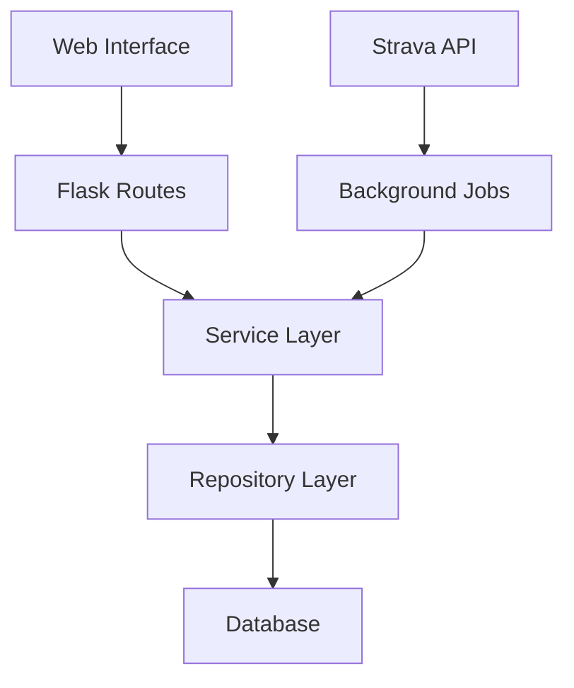

# System Patterns

## Architecture Overview
- Flask-based web application with RESTful API
- Background job processing for data synchronization
- Modular design with clear separation of concerns
- Layered architecture (presentation, business logic, data access)

## Key Design Patterns
1. Repository Pattern
   - Abstract data access layer
   - Centralized data operations
   - Consistent interface for database interactions

2. Service Layer
   - Business logic encapsulation
   - Transaction management
   - Error handling and logging

3. Background Job Processing
   - Asynchronous task execution
   - Job queue management
   - Retry mechanisms for failed jobs

4. API Integration
   - Rate limiting and throttling
   - Exponential backoff for retries
   - Comprehensive error handling

5. Data Validation
   - Input sanitization
   - Schema validation
   - Data quality checks

## Component Relationships

## Error Handling Strategy
- Centralized error logging
- Graceful degradation
- User-friendly error messages
- Automatic retry mechanisms
- Comprehensive monitoring
